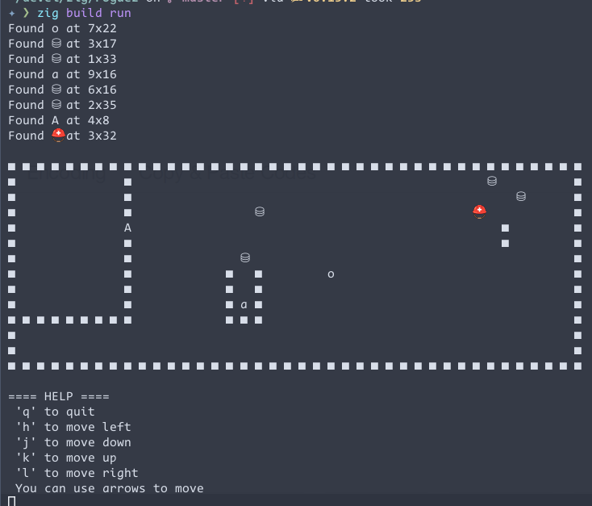

# RogueZ

A simple roguelike game written in Zig.

- Tested with Zig 0.15.2
- Run with: `zig build run`

## Files

### Entry point
- `src/main.zig`: entry point and game loop

### Core game logic
- `src/board.zig`: static parts of the world (walls, floors, flag, ...) called *tiles*
- `src/game.zig`: core game logic (collisions, movement, viewport, ...)
- `src/state.zig`: dynamic elements (robot, boxes, keys, doors, ...) called *items*

### Supported structures
- `src/item.zig`: an element of the state
- `src/map.zig`: contains the map as a string
- `src/pos.zig`: is the position of an object on the board (*row x col*)

*Note: "tiles" are static parts of the world that cannot be interacted with. "Items" are objects that can move or be interacted with, even if they don't move.*

# Roadmap

- [x] Move robot around an empty map
- [x] Create and display a board
- [x] Add doors to the board
- [x] Add keys to open doors
- [x] Allow moving one box to an empty space
- [ ] Retrieve a key
- [ ] Open door with the corresponding key
- [ ] Add an end when the flag is captured
- [ ] Allow moving several boxes at once
- [ ] Implement a viewport for larger worlds
- [ ] ...

# Screenshots

