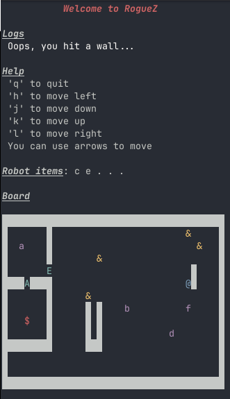

# RogueZ

- A simple roguelike game written in Zig
- Tested with Zig 0.15.2
- Run with: `zig build run`

# Files

- `src/main.zig`: entry point and game loop.
- `src/game.zig`: core game logic (collisions, movement, viewport, ...).
- `src/board.zig`: static part of the world (walls, floors, doors, ...).
- `src/state.zig`: dynamic parts (robot positions, enemies, ...).

# Roadmap

- [ ] Add enemies
- [ ] Add keys to open doors
- [ ] Add doors to the board
- [ ] Implement a viewport for larger worlds
- [ ] Allow moving objects
- [ ] Add interactive/moving objects
- [x] Move robot around an empty map
- [x] Create and display a board

# Screenshots

